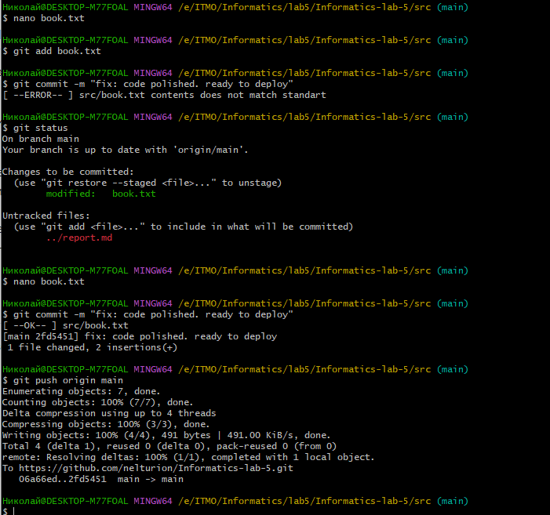
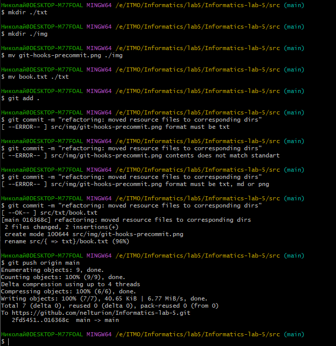
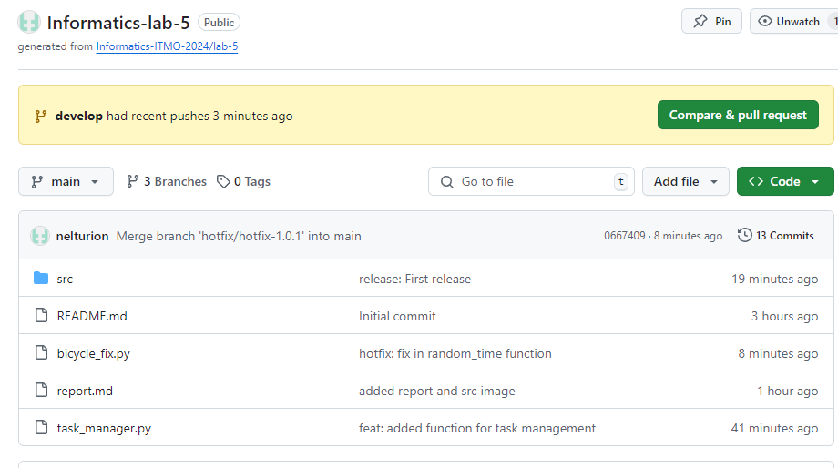

# Лабораторная работа 5

## Тема: Open Git Bash Here

## Цель работы

Научиться пользоваться Git как ~~не~~нормальные люди

## Ход работы

### Сетап
Перед выполнением заданий, я создал репозиторий и потренировался в разрешении конфликтов между ветками.

Для выполнения работы я использовал результат тренировки - файл book.txt

### Задание 1: Автоматизация проверки формата файлов при коммите 
Для того, чтобы автоматизировать проверку формата файлов перед коммитом нужны какие-то правила:
1) ~~Коммитируемые~~ Отправляемые в удаленный репозиторий файлы (файлы контроль версий которых мы осуществляем) должны быть в формате .txt
2) В начале файлов должно быть ключевое слово import. Это было бы полезно, если мы писали программу на языке python

```bash
#!/bin/sh

for file in $(git diff --cached --name-only); do
    # Проверка формата файла
    if [[ $file == *.txt ]]; then  # если это txt, то смотрим его содержимое
        if grep -q "import" "$file"; then
    	    echo "[ --OK-- ] $file " # файл имеет слово import в самом начале и соответствует необходимому формату
        else
            echo "[ --ERROR-- ] $file contents does not match standart"
            exit 1
        fi
    else
        echo "[ --ERROR-- ] $file format must be txt"
        exit 1
    fi
done

exit 0
```


3) Однако, я немного затупил и вспомнил, что мне нужно будет добавить отчет со скринами... и обновил код для pre-commit
```bash
#!/bin/sh

for file in $(git diff --cached --name-only); do
    # Проверка формата файла
    if [[ $file == *.png || $file == *.md || $file == *.txt ]]; then
        if [[ $file == *.txt ]]; then  # если это txt, то смотрим его содержимое
            if grep -q "import" "$file"; then
    	        echo "[ --OK-- ] $file " # файл имеет слово import в самом начале и соответствует необходимому формату
            else
                echo "[ --ERROR-- ] $file contents does not match standart"
                exit 1
            fi
        fi
    else
        echo "[ --ERROR-- ] $file format must be txt, md or png"
        exit 1
    fi
done

exit 0
```



### Задание 2: Использование Git Flow в проекте 

Итак, что я сделал:
1) создал и настроил git flow
```bash
git flow init
```
2) настроил названия для веток feature develop hotfix и release
3) создал условный файл програмы таск-менеджера
4) закоммитил все
5) смерджил ветку develop с main
5) выпустил релиз 😎
6) узнал что (обожемой) код не работает и выпустил hotfix
7) запушил хотфикс 
Это было сложное задание с точки зрения управления ветками, но я вроде справился...

